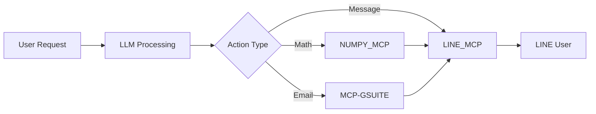

# LINE MCP Server

A comprehensive Model Context Protocol (MCP) server for LINE Messenger integration, providing AI assistants with powerful messaging capabilities including text messages, rich content, user management, and broadcasting features.

## 🚀 Features

- **Text Messaging**: Send text messages with optional quick replies
- **Rich Content**: Create interactive buttons, carousels, and confirmation dialogs
- **Image Messaging**: Send images with preview support
- **User Management**: Retrieve user profiles and group information
- **Flex Messages**: Custom layouts for enhanced user experience
- **Broadcasting**: Send messages to all bot friends
- **Error Handling**: Robust error handling with detailed feedback
- **Integration Ready**: Seamlessly works with other MCP servers (NUMPY_MCP, MCP-GSUITE)

## 📋 Prerequisites

- Python 3.8+
- LINE Developers Account
- Valid webhook endpoint (HTTPS required for production)
- MCP Client (supports Azure OpenAI, OpenAI, and Gemini)

## 🛠️ Installation

1. **Install Dependencies**:
   ```bash
   cd mcp_servers/python/servers/LINE_MCP
   pip install -r requirements.txt
   ```

2. **Set up LINE Bot**:
   - Go to [LINE Developers Console](https://developers.line.biz/)
   - Create a provider and Messaging API channel
   - Get your Channel Access Token and Channel Secret
   - Configure webhook URL

3. **Configure MCP Client**:
   ```json
   {
     "selected_server_credentials": {
       "LINE_MCP": {
         "channel_access_token": "your_channel_access_token",
         "channel_secret": "your_channel_secret",
         "webhook_url": "https://yourdomain.com/webhook"
       }
     }
   }
   ```

## 🚀 Quick Start

### Basic Text Message
```bash
# Send a simple text message
"Send a text message 'Hello from LINE MCP!' to user U1234567890"
```

### Rich Interactive Message
```bash
# Send buttons template
"Send a buttons template to user U1234567890 with title 'Choose Service' and buttons for 'Support', 'Sales', and 'Help'"
```

### Mathematical Integration
```bash
# Combine with NUMPY_MCP for calculations
"Calculate eigenvalues of matrix [[4,2],[1,3]] and send results to LINE user U1234567890"
```

### Email Integration
```bash
# Combine with MCP-GSUITE for email management
"Check recent emails and send summary to LINE user U1234567890"
```

## 🛠️ Available Tools

### Core Messaging Tools

| Tool | Description | Parameters |
|------|-------------|------------|
| `send_text_message` | Send text with optional quick replies | `to`, `message`, `quick_replies` |
| `send_rich_message` | Send interactive templates | `to`, `template_type`, `content` |
| `send_image_message` | Send images | `to`, `original_content_url`, `preview_image_url` |
| `send_flex_message` | Custom layout messages | `to`, `alt_text`, `flex_content` |
| `broadcast_message` | Message all friends | `message` |

### User Management Tools

| Tool | Description | Parameters |
|------|-------------|------------|
| `get_user_profile` | Get user information | `user_id` |
| `get_group_summary` | Get group information | `group_id` |

## 🎯 Use Cases

### 1. Customer Support Bot
```json
{
  "template_type": "buttons",
  "content": {
    "title": "Customer Support",
    "text": "How can we help you?",
    "actions": [
      {"type": "message", "label": "Technical Issue", "text": "I have a technical problem"},
      {"type": "message", "label": "Billing Question", "text": "I have a billing question"},
      {"type": "uri", "label": "Help Center", "uri": "https://help.example.com"}
    ]
  }
}
```

### 2. Educational Math Assistant
```json
{
  "template_type": "carousel",
  "content": {
    "columns": [
      {
        "title": "📊 Matrix Operations",
        "text": "Linear algebra calculations",
        "actions": [{"type": "message", "label": "Start", "text": "Help with matrices"}]
      },
      {
        "title": "📈 Statistics", 
        "text": "Data analysis",
        "actions": [{"type": "message", "label": "Start", "text": "Help with statistics"}]
      }
    ]
  }
}
```

### 3. Productivity Dashboard
```json
{
  "type": "simple_card",
  "content": {
    "title": "📅 Daily Summary",
    "description": "Your productivity dashboard",
    "actions": [
      {"type": "message", "label": "Check Emails", "text": "Show recent emails"},
      {"type": "message", "label": "Calculate", "text": "Help with math"}
    ]
  }
}
```

## 🔗 Multi-Server Integration

### LINE + NUMPY + GSUITE Workflow


**Example Flow**:
1. User asks: "Check my emails and calculate average per day"
2. MCP-GSUITE fetches recent emails
3. NUMPY_MCP calculates statistics
4. LINE_MCP sends formatted results with interactive options

## 📚 Documentation

- **[Server Features](../../mcp_servers_documentation/LINE_MCP/server_features.md)**: Comprehensive tool documentation
- **[Credentials Setup](../../mcp_servers_documentation/LINE_MCP/credentials.md)**: Step-by-step LINE bot configuration
- **[Demo Videos](../../mcp_servers_documentation/LINE_MCP/demo_videos.md)**: Video demonstrations and examples

## 🧪 Testing with Postman

Import the provided Postman collection for testing:

1. **Basic Text Messaging**: Test simple text messages
2. **Rich Content**: Test buttons, carousels, and confirmations
3. **User Management**: Test profile and group information retrieval
4. **Multi-Server Integration**: Test combined workflows

### Example Postman Request
```json
{
  "selected_server_credentials": {
    "LINE_MCP": {
      "channel_access_token": "your_token",
      "channel_secret": "your_secret",
      "webhook_url": "your_webhook"
    }
  },
  "client_details": {
    "api_key": "your_llm_api_key",
    "temperature": 0.1,
    "max_token": 20000,
    "input": "Send a welcome message to user U1234567890",
    "prompt": "you are a helpful LINE messaging assistant",
    "chat_model": "gemini-2.0-flash"
  },
  "selected_client": "MCP_CLIENT_GEMINI",
  "selected_servers": ["LINE_MCP"]
}
```

## 🔧 Configuration Options

### Server Configuration
Add to `client_and_server_config.py`:
```python
{
  "server_name": "LINE_MCP",
  "command": "python",
  "args": ["mcp_servers/python/servers/LINE_MCP/line_mcp.py"]
}
```

### Credential Injection
The server automatically handles credential injection for:
- Channel access token authentication
- Webhook signature verification
- Error handling and rate limiting

## 🚨 Error Handling

The server provides detailed error messages for:
- **Invalid Credentials**: Missing or incorrect LINE API credentials
- **Network Issues**: Connection problems with LINE API
- **Rate Limiting**: Automatic handling of LINE API rate limits
- **User Permissions**: Blocked users or missing bot permissions
- **Message Format**: Invalid message content or structure

## 🔒 Security Features

- **Credential Security**: Credentials passed securely through MCP protocol
- **Webhook Verification**: Channel secret used for signature verification
- **Rate Limiting**: Built-in protection against API abuse
- **Error Sanitization**: Sensitive information filtered from error messages

## 📊 Performance Considerations

### LINE API Limits
- **Push Messages**: 500 requests/second
- **Broadcast Messages**: Plan-dependent limits
- **Profile API**: 1,000 requests/second

### Optimization Tips
- Batch multiple operations when possible
- Use appropriate message types for content
- Implement proper error handling and retries
- Monitor API usage in LINE Developer Console

## 🤝 Contributing

1. Fork the repository
2. Create your feature branch
3. Add tests for new functionality
4. Update documentation
5. Submit a pull request

## 📝 License

This project is licensed under the MIT License - see the [LICENSE](../../../../LICENSE) file for details.

## 🆘 Support

### Getting Help
- **Documentation**: Check the comprehensive guides in `mcp_servers_documentation/LINE_MCP/`
- **Issues**: Report bugs or request features via GitHub issues
- **Community**: Join our Discord/Slack for real-time support

### Common Issues
- **Bot not responding**: Check credentials and webhook configuration
- **Permission denied**: Ensure bot is friends with target users
- **Rate limiting**: Implement proper retry logic and monitoring

## 🎉 Acknowledgments

- LINE Corporation for the robust Messaging API
- MCP Community for the protocol specification
- Contributors and testers who helped improve this server

## 🚀 What's Next?

- **Rich Menu Support**: Enhanced user interface options
- **Audio/Video Messages**: Multimedia content support
- **Advanced Analytics**: Message delivery and engagement tracking
- **Template Library**: Pre-built message templates for common use cases

---

**Ready to get started?** Follow the [credentials setup guide](../../mcp_servers_documentation/LINE_MCP/credentials.md) to configure your LINE bot and begin sending messages through the MCP protocol!
